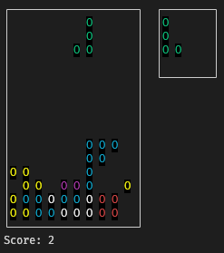
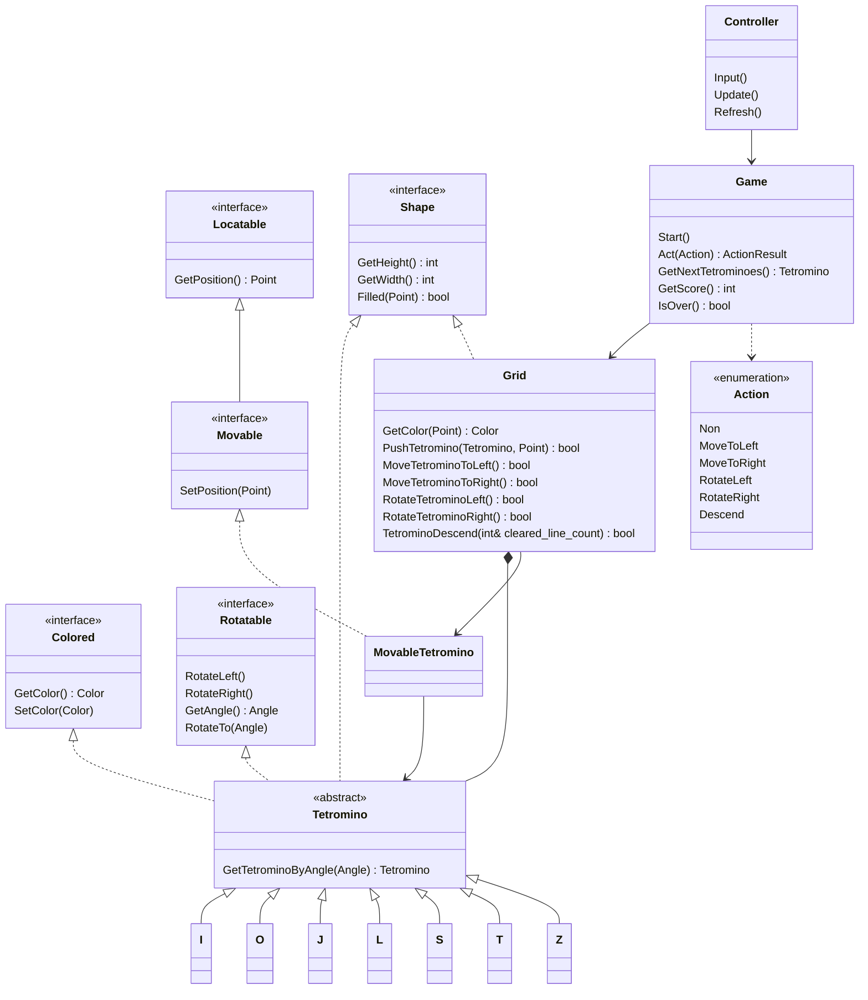

# Tetris


[](https://cmake.org)
[](https://www.docker.com)
[](https://github.com/features/actions)


## Introduction



A *Tetris* game running in the *Linux* terminal.

## Prerequisites

- Install [*CMake*](https://cmake.org).
- Install [*GoogleTest*](https://google.github.io/googletest).
- Install [*ncurses*](https://invisible-island.net/ncurses).

## Building

Set the location to the project folder and run:

```bash
mkdir build
cd build
cmake -DTETRIS_BUILD_TESTS=ON ..
cmake --build .
```

## Running Tests

Set the location to the `build` folder and run:

```bash
ctest -VV
```

## Running the Game

Set the location to the `build/bin` folder and run:

```bash
./tetris -x=<width> -y=<height>
```

For example:

```bash
./tetris -x=10 -y=15
```

## Structure

```
.
├── .clang-format
├── .gitignore
├── CITATION.cff
├── CMakeLists.txt
├── Dockerfile
├── LICENSE
├── README.md
├── cover.png
├── docs
│   └── badges
│       ├── C++.svg
│       ├── License-MIT.svg
│       ├── Linux.svg
│       ├── Made-with-CMake.svg
│       ├── Made-with-GitHub-Actions.svg
│       └── Made-with-Docker.svg
├── include
│   ├── args.h
│   ├── color.h
│   ├── controller.h
│   ├── game.h
│   ├── grid.h
│   ├── location.h
│   ├── rotation.h
│   ├── shape.h
│   └── tetromino.h
├── src
│   ├── CMakeLists.txt
│   ├── args
│   │   ├── CMakeLists.txt
│   │   └── args.cpp
│   ├── color
│   │   ├── CMakeLists.txt
│   │   └── color.cpp
│   ├── controller
│   │   ├── CMakeLists.txt
│   │   ├── controller.cpp
│   │   └── ui
│   │       ├── board.h
│   │       ├── color_env.cpp
│   │       ├── color_env.h
│   │       ├── grid_board.h
│   │       ├── next_tetromino_board.h
│   │       └── score_board.h
│   ├── game
│   │   ├── CMakeLists.txt
│   │   └── game.cpp
│   ├── grid
│   │   ├── CMakeLists.txt
│   │   └── grid.cpp
│   ├── location
│   │   └── CMakeLists.txt
│   ├── main.cpp
│   ├── rotation
│   │   ├── CMakeLists.txt
│   │   └── rotation.cpp
│   ├── shape
│   │   └── CMakeLists.txt
│   └── tetromino
│       ├── CMakeLists.txt
│       ├── subtype
│       │   ├── i.h
│       │   ├── j.h
│       │   ├── l.h
│       │   ├── o.h
│       │   ├── s.h
│       │   ├── t.h
│       │   └── z.h
│       └── tetromino.cpp
└── tests
    ├── CMakeLists.txt
    ├── grid_test.cpp
    ├── rotation_test.cpp
    └── tetromino_test.cpp
```

## Class Diagram



## License

Distributed under the *MIT License*. See `LICENSE` for more information.